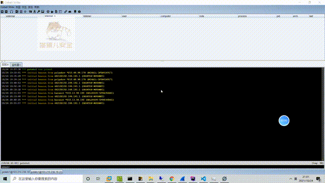

# Anti_AntSword

端内钓鱼，反制红队

蚁剑反制马



```
1.脚本小子日站爆目录
2.爆到一个shell.php
3.通过弱口令蚁剑连接成功
3.读取文件和目录都没有问题，常见的命令执行没有问题，但是上传下载显示连通性出现问题
4.执行命令突然报错，后面出现一个欺骗性很高的域名和伪装度极高的网站
5.急不可耐的点击进去，渲染恶意js脚本
6.明线：脚本小子开始查看文档寻找解决方法。暗线：C2上线查户口
```

猫蛋儿安全公众号


